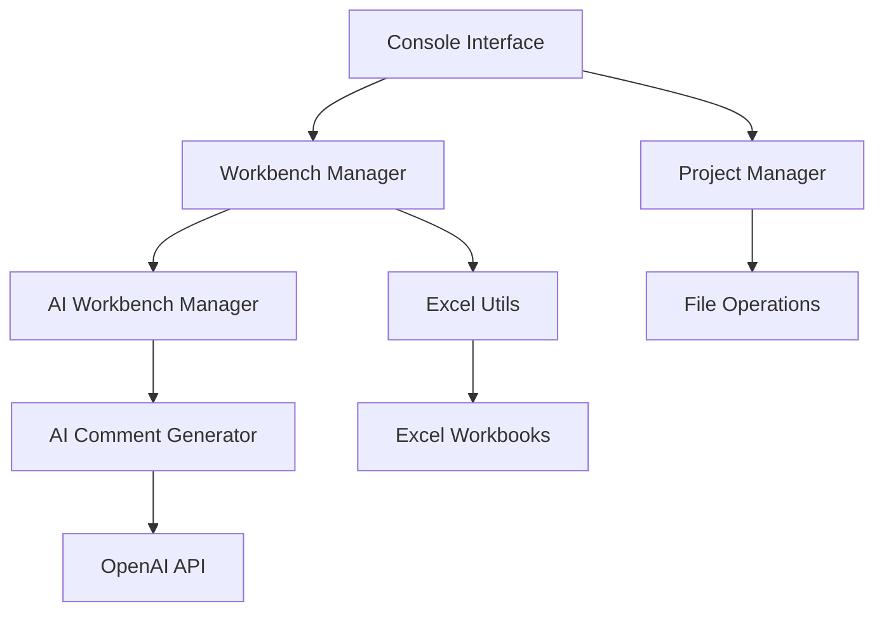

# DWH Creator - Data Warehouse Creation Tool

[](https://github.com/dwhbiAdmin/DWH_Creator)
[](https://python.org)
[](LICENSE)

## 📋 Table of Contents

- [Overview](#overview)
- [Features](#features)
- [Architecture](#architecture)
- [Installation](#installation)
- [Quick Start](#quick-start)
- [User Guides](#user-guides)
- [Technical Documentation](#technical-documentation)
- [API Reference](#api-reference)
- [Contributing](#contributing)
- [Support](#support)

## 🎯 Overview

**DWH Creator** is a comprehensive data warehouse creation and management tool that streamlines the process of building, documenting, and maintaining data warehouse structures. It combines Excel-based workbench management with AI-powered automation to create business-ready data warehouse artifacts.

### Key Capabilities

- **Project Management**: Create and manage data warehouse projects with standardized structures
- **Excel Workbench Integration**: Seamless integration with Excel for data modeling and documentation
- **AI-Powered Automation**: Generate business comments, readable column names, and documentation using OpenAI
- **Multi-Stage Architecture**: Support for drop zone, bronze, silver, and gold layer implementations
- **Business Intelligence Ready**: Generate artifacts optimized for Power BI and other BI tools

## ✨ Features

### 🏗️ **Project Management**
- Create new DWH projects with standardized folder structures
- Open and manage existing projects
- Excel workbook integration with automatic file handling

### 🤖 **AI-Powered Features**
- **Artifact Comments**: Generate business-friendly descriptions for data artifacts
- **Column Comments**: Create detailed explanations for database columns
- **Readable Column Names**: Convert technical names to business-friendly snake_case format
- **Smart Validation**: AI-powered data quality and consistency checks

### 📊 **Workbench Operations**
- **Stages Management**: Define and manage data processing stages
- **Artifacts Management**: Create and organize data artifacts
- **Columns Management**: Define column structures with business metadata
- **Import/Assignment**: Import data from source systems
- **Cascade Operations**: Propagate changes across data layers

### 🔄 **Data Integration**
- Source system connectivity
- ETL process management
- Data lineage tracking
- Business rule enforcement

## 🏛️ Architecture



### Core Components

1. **Frontend Layer**
   - `src/frontend/console_interface.py` - Main user interface
   - Menu-driven navigation and user interactions

2. **Backend Layer**
   - `src/backend/project_manager.py` - Project lifecycle management
   - `src/backend/workbench_manager.py` - Core workbench operations
   - `src/backend/ai_workbench_manager.py` - AI-powered features

3. **Utilities Layer**
   - `src/utils/excel_utils.py` - Excel file operations
   - `src/utils/ai_comment_generator.py` - AI integration
   - `src/utils/config_manager.py` - Configuration management
   - `src/utils/logger.py` - Logging and monitoring

## 🚀 Installation

### Prerequisites

- Python 3.8 or higher
- Microsoft Excel (for workbook operations)
- OpenAI API key (for AI features)

### Setup Steps

1. **Clone the Repository**
   ```bash
   git clone https://github.com/dwhbiAdmin/DWH_Creator.git
   cd DWH_Creator
   ```

2. **Install Dependencies**
   ```bash
   pip install -r requirements.txt
   ```

3. **Configure OpenAI API**
   ```bash
   # Create config file
   cp config/config.ini.template config/config.ini
   
   # Edit config.ini and add your OpenAI API key
   [openai]
   api_key = your_openai_api_key_here
   model = gpt-3.5-turbo
   ```

4. **Run the Application**
   ```bash
   python main.py --console
   ```

## 🏁 Quick Start

### Creating Your First Project

1. **Start the Application**
   ```bash
   python main.py --console
   ```

2. **Create New Project**
   - Select option `1. Create New Project`
   - Enter project name (e.g., "MyDataWarehouse")
   - Choose project location or use default

3. **Configure Workbench**
   - Navigate to `3. Workbench Operations`
   - Open stages, artifacts, and columns sheets
   - Import data from source systems

4. **Generate AI Content**
   - Use `5. Generate AI Comments (Artifacts)`
   - Use `6. Generate AI Comments (Columns)`
   - Use `7. Generate Readable Column Names`

### Example Workflow

```bash
# 1. Create project
DWH Creator > 1. Create New Project
Project Name: AdventureWorks
Location: [default]

# 2. Import source data
Workbench Operations > 4. Import/Assign from 1_sources

# 3. Generate AI content
Workbench Operations > 7. Generate Readable Column Names
Generated: cust_ID → customer_id, order_dt → order_date

# 4. Save and validate
Workbench Operations > 10. Save Workbook
```

## 📖 User Guides

### General Usage
- [Getting Started Guide](user-guides/getting-started.md)
- [Project Management](user-guides/project-management.md)
- [Workbench Operations](user-guides/workbench-operations.md)

### AI Features
- [AI-Powered Comments](user-guides/ai-comments.md)
- [Readable Column Names](user-guides/readable-column-names.md)
- [AI Configuration](user-guides/ai-configuration.md)

### Advanced Topics
- [Data Integration](user-guides/data-integration.md)
- [Business Rules](user-guides/business-rules.md)
- [Troubleshooting](user-guides/troubleshooting.md)

## 🔧 Technical Documentation

### Architecture & Design
- [System Architecture](technical/architecture.md)
- [Database Design](technical/database-design.md)
- [AI Integration](technical/ai-integration.md)

### Development
- [Developer Setup](technical/developer-setup.md)
- [Code Standards](technical/code-standards.md)
- [Testing Guide](technical/testing.md)

### Deployment
- [Installation Guide](technical/installation.md)
- [Configuration Reference](technical/configuration.md)
- [Performance Tuning](technical/performance.md)

## 📚 API Reference

### Core Classes
- [`ProjectManager`](technical/api/project-manager.md) - Project lifecycle management
- [`WorkbenchManager`](technical/api/workbench-manager.md) - Core workbench operations
- [`AIWorkbenchManager`](technical/api/ai-workbench-manager.md) - AI-powered features

### Utilities
- [`ExcelUtils`](technical/api/excel-utils.md) - Excel file operations
- [`AICommentGenerator`](technical/api/ai-comment-generator.md) - AI integration
- [`ConfigManager`](technical/api/config-manager.md) - Configuration management

## 🤝 Contributing

We welcome contributions to DWH Creator! Please see our [Contributing Guide](CONTRIBUTING.md) for details.

### Development Workflow

1. Fork the repository
2. Create a feature branch
3. Make your changes
4. Add tests and documentation
5. Submit a pull request

### Code Style

- Follow PEP 8 for Python code
- Use meaningful variable and function names
- Add docstrings to all functions and classes
- Include type hints where appropriate

## 📞 Support

### Getting Help

- **Documentation**: Check this documentation first
- **Issues**: [GitHub Issues](https://github.com/dwhbiAdmin/DWH_Creator/issues)
- **Discussions**: [GitHub Discussions](https://github.com/dwhbiAdmin/DWH_Creator/discussions)

### Common Issues

- **Excel File Access**: Ensure Excel files are closed before operations
- **OpenAI API**: Verify API key configuration in `config/config.ini`
- **Python Dependencies**: Run `pip install -r requirements.txt`

### Version History

- **v1.0.0** (2025-09-13): Initial release with AI features
- **v0.9.0** (2025-09-01): Beta release with core functionality
- **v0.5.0** (2025-08-15): Alpha release with basic features

---

## 📄 License

This project is licensed under the MIT License - see the [LICENSE](LICENSE) file for details.

---

**Built with ❤️ by the DWH Creator Team**
