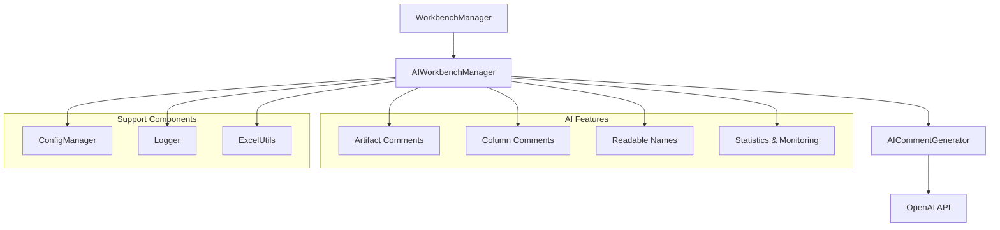
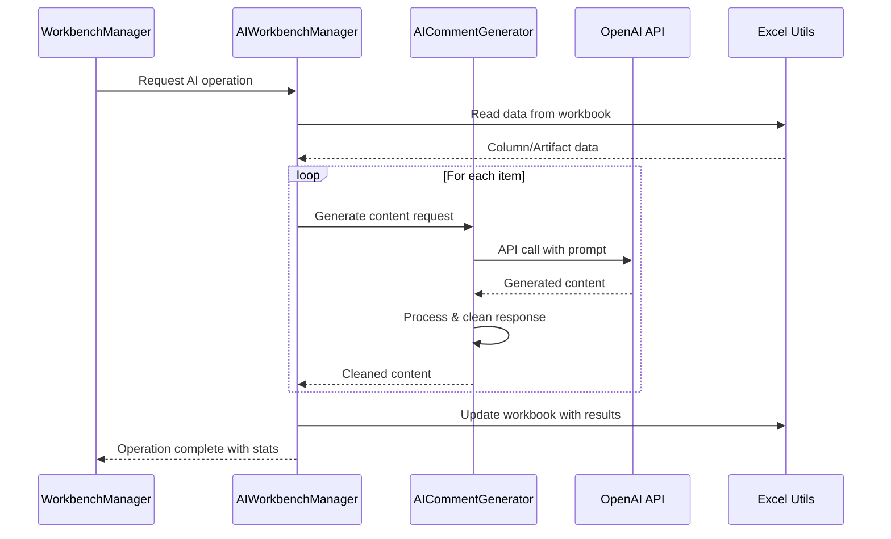

# AI Integration - Technical Documentation

## 📋 Table of Contents
- [Overview](#overview)
- [Architecture](#architecture)
- [Component Details](#component-details)
- [Prompt Engineering](#prompt-engineering)
- [API Integration](#api-integration)
- [Error Handling](#error-handling)
- [Performance Optimization](#performance-optimization)
- [Configuration](#configuration)
- [Testing](#testing)
- [Troubleshooting](#troubleshooting)

## 🤖 Overview

The AI Integration module provides intelligent automation capabilities for the DWH Creator, leveraging OpenAI's GPT models to generate business-friendly content, documentation, and naming conventions. The system is designed for reliability, scalability, and ease of maintenance.

### Key AI Features

1. **Artifact Comments**: Generate business descriptions for data artifacts
2. **Column Comments**: Create detailed explanations for database columns  
3. **Readable Column Names**: Convert technical names to business-friendly snake_case format
4. **Data Validation**: AI-powered quality checks and suggestions

### Design Goals

- **Reliability**: Robust error handling and fallback mechanisms
- **Performance**: Efficient API usage and response processing
- **Maintainability**: Clean separation of AI logic from business logic
- **Extensibility**: Easy to add new AI-powered features

## 🏛️ Architecture

### AI Component Hierarchy



### Data Flow for AI Operations



## 🔧 Component Details

### 1. AI Workbench Manager

**File**: `src/backend/ai_workbench_manager.py`

#### 🔗 ANCHOR: AIWorkbenchManager Class Definition

```python
class AIWorkbenchManager:
    """
    Manages AI-powered operations for Excel workbench data.
    
    Responsibilities:
    - Coordinate AI operations across workbook data
    - Manage batch processing of AI requests
    - Handle errors and provide fallback mechanisms
    - Track statistics and performance metrics
    """
```

#### Key Methods

##### 🔗 ANCHOR: generate_readable_column_names Method

**Purpose**: Generate business-friendly column names for all columns in the workbook

**Implementation Strategy**:
1. Read columns from Excel workbook
2. Filter columns needing readable names
3. Batch process through AI generator
4. Update workbook with results
5. Provide detailed logging and statistics

```python
def generate_readable_column_names(self) -> bool:
    """
    Generate readable column names for all columns.
    
    Returns:
        bool: True if successful, False otherwise
        
    Process:
    1. Read column data from Excel
    2. Identify columns needing names
    3. Generate names using AI
    4. Update workbook with results
    5. Log statistics and errors
    """
```

**Error Handling**:
- Excel file access errors
- AI API failures
- Data validation issues
- Partial completion scenarios

##### 🔗 ANCHOR: _generate_readable_column_names Method

**Purpose**: Core implementation of readable name generation

**Key Features**:
- Batch processing with progress tracking
- Individual error handling per column
- Type safety with pandas DataFrame operations
- Detailed logging for troubleshooting

```python
def _generate_readable_column_names(self, columns_df: pd.DataFrame) -> bool:
    """
    Internal method for generating readable names.
    
    Args:
        columns_df: DataFrame containing column information
        
    Returns:
        bool: Success status
        
    Features:
    - Progress tracking and logging
    - Individual column error handling
    - Type-safe DataFrame operations
    - Comprehensive statistics
    """
```

### 2. AI Comment Generator

**File**: `src/utils/ai_comment_generator.py`

#### 🔗 ANCHOR: AI Client Initialization

```python
def __init__(self, openai_api_key: str = None):
    """
    Initialize AI Comment Generator.
    
    Args:
        openai_api_key: OpenAI API key for authentication
        
    Features:
    - Graceful handling of missing API keys
    - Configuration-based model selection
    - Connection validation
    """
    self.client = None
    if openai_api_key:
        try:
            self.client = OpenAI(api_key=openai_api_key)
            self.model = ConfigManager.get_ai_model()  # Configurable model
        except Exception as e:
            print(f"Failed to initialize AI client: {e}")
```

#### 🔗 ANCHOR: generate_readable_column_name Method

**Purpose**: Generate individual readable column name using AI

**Implementation Details**:

```python
def generate_readable_column_name(self, column_name: str, data_type: str) -> str:
    """
    Generate a human-readable column name for business artifacts.
    
    Args:
        column_name: Technical column name from source
        data_type: Data type of the column
        
    Returns:
        Business-friendly snake_case column name
        
    Features:
    - Optimized prompt engineering
    - Response cleaning and validation
    - Consistent snake_case formatting
    - Error handling with empty fallback
    """
```

## 🎯 Prompt Engineering

### Design Principles

1. **Specificity**: Clear, unambiguous instructions
2. **Context**: Provide business context and use cases
3. **Examples**: Include transformation examples
4. **Constraints**: Define format and length requirements
5. **Consistency**: Standardized prompt structure

### 🔗 ANCHOR: AI Prompt Engineering

#### Readable Column Names Prompt

**Location**: `src/utils/ai_comment_generator.py`

```python
prompt = f"""
Convert this technical database column name into a business-friendly snake_case name 
for data warehouse gold layer:

Technical Name: {column_name}
Data Type: {data_type}

Rules:
- Use snake_case (lowercase with underscores)
- Keep "id" as "id", never use "identifier"  
- Make business-friendly but concise
- Avoid technical jargon and cryptic abbreviations
- Maximum 50 characters
- Return ONLY the column name, no prefixes or explanations

Examples:
- cust_id → customer_id
- order_dt → order_date
- total_amt → total_amount
- prod_cat_cd → product_category_code
- created_ts → created_timestamp
- CUST_FIRST_NM → customer_first_name
- ORD_STS_CD → order_status_code
- SALES_AMT_USD → sales_amount_usd
- emp_id → employee_id
- acct_id → account_id
"""
```

#### Prompt Optimization Strategies

1. **Token Efficiency**: Minimize prompt length while maintaining clarity
2. **Example Quality**: Use diverse, representative examples
3. **Rule Clarity**: Explicit formatting and content rules
4. **Context Relevance**: Business domain-specific guidance

### Response Processing

#### 🔗 ANCHOR: Response Processing

**Purpose**: Clean and standardize AI responses

```python
def _process_ai_response(self, raw_response: str) -> str:
    """
    Clean and standardize AI response.
    
    Processing Steps:
    1. Strip whitespace and quotes
    2. Remove common AI prefixes
    3. Ensure snake_case format
    4. Replace "identifier" with "id"
    5. Validate length constraints
    6. Handle edge cases
    """
    
    # Remove quotes and whitespace
    clean_response = raw_response.strip('"\'()[]{}')
    
    # Remove AI response prefixes
    prefixes_to_remove = [
        "Business-Friendly Name:", 
        "Business Name:", 
        "Readable Name:",
        "Column Name:",
        "Name:",
        "Output:",
        "Result:"
    ]
    
    for prefix in prefixes_to_remove:
        if clean_response.startswith(prefix):
            clean_response = clean_response[len(prefix):].strip()
            break
    
    # Ensure snake_case and standardize
    clean_response = clean_response.lower().replace(" ", "_")
    clean_response = clean_response.replace("identifier", "id")
    clean_response = clean_response.replace("_id_", "_id")  # Avoid double id
    
    return clean_response[:50]  # Length limit
```

## 🔌 API Integration

### OpenAI API Configuration

#### Configuration Settings

**File**: `config/config.ini`

```ini
[openai]
api_key = your_openai_api_key_here
model = gpt-3.5-turbo
temperature = 0.3
max_tokens = 30
timeout = 30
retry_attempts = 3
```

#### API Call Implementation

```python
def _make_api_call(self, prompt: str) -> str:
    """
    Make OpenAI API call with error handling.
    
    Features:
    - Configurable parameters
    - Timeout handling
    - Retry logic
    - Rate limiting awareness
    """
    try:
        response = self.client.chat.completions.create(
            model=self.model,
            messages=[{"role": "user", "content": prompt}],
            max_tokens=self.max_tokens,
            temperature=self.temperature,
            timeout=self.timeout
        )
        return response.choices[0].message.content.strip()
    except Exception as e:
        self.logger.error(f"API call failed: {e}")
        return ""
```

### Rate Limiting and Quotas

1. **Request Batching**: Group related operations
2. **Exponential Backoff**: Handle rate limit responses
3. **Quota Monitoring**: Track usage against limits
4. **Graceful Degradation**: Continue operation on API failures

## 🛡️ Error Handling

### Error Categories

#### 1. API Errors

**Types**:
- Authentication failures (401)
- Rate limiting (429) 
- Model availability issues
- Network connectivity problems

**Handling Strategy**:
```python
# 🔗 ANCHOR: API Error Handling
try:
    response = self.client.chat.completions.create(...)
except openai.RateLimitError:
    self.logger.warning("Rate limit exceeded, retrying...")
    time.sleep(exponential_backoff())
    return self._retry_api_call(prompt)
except openai.AuthenticationError:
    self.logger.error("Invalid API key")
    return ""
except Exception as e:
    self.logger.error(f"Unexpected API error: {e}")
    return ""
```

#### 2. Data Processing Errors

**Types**:
- Invalid column data
- DataFrame operation failures
- Type conversion issues
- Excel file access problems

**Handling Strategy**:
- Validate input data before processing
- Use pandas error handling mechanisms
- Provide meaningful error messages
- Continue processing remaining items

#### 3. Configuration Errors

**Types**:
- Missing API keys
- Invalid configuration values
- File path issues

**Handling Strategy**:
- Validate configuration on startup
- Provide clear error messages
- Offer fallback configurations
- Guide user to correct configuration

### Error Recovery Mechanisms

1. **Partial Completion**: Complete successful operations even if some fail
2. **Retry Logic**: Automatic retry for transient failures
3. **Fallback Values**: Use default values when AI fails
4. **User Notification**: Clear feedback on what succeeded/failed

## ⚡ Performance Optimization

### Optimization Strategies

#### 1. Batch Processing

```python
# Process multiple columns in efficient batches
def _batch_process_columns(self, columns: List[Tuple]) -> Dict[str, str]:
    """
    Process columns in optimized batches.
    
    Features:
    - Minimize API calls
    - Parallel processing where possible
    - Progress tracking
    - Error isolation per batch
    """
```

#### 2. Caching Mechanisms

```python
# Cache frequently used results
@lru_cache(maxsize=1000)
def _get_cached_readable_name(self, column_name: str, data_type: str) -> str:
    """
    Cache AI responses to avoid redundant API calls.
    
    Benefits:
    - Reduce API usage
    - Improve response time
    - Consistent results
    """
```

#### 3. Connection Pooling

- Reuse OpenAI client connections
- Minimize initialization overhead
- Handle connection lifecycle properly

### Performance Monitoring

#### Metrics Collection

```python
# 🔗 ANCHOR: Performance Metrics
class AIPerformanceMetrics:
    def __init__(self):
        self.api_call_count = 0
        self.success_rate = 0.0
        self.average_response_time = 0.0
        self.error_count = 0
        
    def track_api_call(self, success: bool, response_time: float):
        """Track individual API call performance."""
        self.api_call_count += 1
        if success:
            self.success_rate = self._calculate_success_rate()
        else:
            self.error_count += 1
        self._update_average_response_time(response_time)
```

## ⚙️ Configuration

### Configuration Hierarchy

1. **Default Values**: Built-in defaults in code
2. **Configuration File**: `config/config.ini`
3. **Environment Variables**: Override for deployment
4. **Runtime Parameters**: User-specified values

### AI-Specific Configuration

#### 🔗 ANCHOR: AI Configuration Management

```python
class AIConfig:
    """Centralized AI configuration management."""
    
    @staticmethod
    def get_openai_config() -> Dict[str, Any]:
        """Get OpenAI configuration with validation."""
        return {
            'api_key': ConfigManager.get_openai_api_key(),
            'model': ConfigManager.get_ai_model('gpt-3.5-turbo'),
            'temperature': ConfigManager.get_ai_temperature(0.3),
            'max_tokens': ConfigManager.get_ai_max_tokens(30),
            'timeout': ConfigManager.get_ai_timeout(30)
        }
    
    @staticmethod
    def validate_config() -> bool:
        """Validate AI configuration before use."""
        config = AIConfig.get_openai_config()
        
        if not config['api_key']:
            logger.error("OpenAI API key not configured")
            return False
            
        if config['temperature'] < 0 or config['temperature'] > 2:
            logger.warning("Invalid temperature value, using default")
            
        return True
```

## 🧪 Testing

### Test Categories

#### 1. Unit Tests

**File**: `tests/test_ai_comment_generator.py`

```python
class TestAICommentGenerator(unittest.TestCase):
    """Test AI comment generation functionality."""
    
    def test_readable_column_name_generation(self):
        """Test successful generation of readable column names."""
        generator = AICommentGenerator("test_key")
        
        with patch.object(generator, 'client') as mock_client:
            mock_response = Mock()
            mock_response.choices[0].message.content = "customer_id"
            mock_client.chat.completions.create.return_value = mock_response
            
            result = generator.generate_readable_column_name("cust_ID", "VARCHAR")
            
            self.assertEqual(result, "customer_id")
            self.assertTrue(mock_client.chat.completions.create.called)
```

#### 2. Integration Tests

**File**: `tests/test_ai_workbench_manager.py`

```python
class TestAIWorkbenchManager(unittest.TestCase):
    """Test AI workbench manager integration."""
    
    @patch('utils.excel_utils.pd.read_excel')
    @patch('utils.excel_utils.openpyxl.load_workbook')
    def test_generate_readable_column_names_integration(self, mock_workbook, mock_read):
        """Test end-to-end readable column names generation."""
        # Test full workflow from Excel read to update
```

#### 3. Performance Tests

```python
class TestAIPerformance(unittest.TestCase):
    """Test AI feature performance characteristics."""
    
    def test_batch_processing_performance(self):
        """Test performance of batch AI operations."""
        # Measure response times, API usage, memory consumption
        
    def test_error_recovery_performance(self):
        """Test performance during error conditions."""
        # Test graceful degradation and recovery times
```

### Test Data Management

#### Mock Responses

```python
# Standard mock responses for consistent testing
MOCK_AI_RESPONSES = {
    'cust_ID': 'customer_id',
    'order_dt': 'order_date',
    'total_amt': 'total_amount',
    'prod_cat_cd': 'product_category_code'
}
```

#### Test Configuration

```python
# Test-specific configuration
TEST_CONFIG = {
    'openai': {
        'api_key': 'test_key',
        'model': 'gpt-3.5-turbo',
        'temperature': 0.3,
        'max_tokens': 30
    }
}
```

## 🔍 Troubleshooting

### Common Issues and Solutions

#### Issue 1: "AI comment generation not available"

**Symptoms**:
- AI features show as unavailable
- Error messages about missing API key

**Diagnosis**:
```python
# Check AI availability
def diagnose_ai_availability():
    config = ConfigManager.get_openai_config()
    
    if not config.get('api_key'):
        print("❌ OpenAI API key not configured")
        return False
        
    try:
        client = OpenAI(api_key=config['api_key'])
        # Test API connectivity
        response = client.chat.completions.create(
            model="gpt-3.5-turbo",
            messages=[{"role": "user", "content": "test"}],
            max_tokens=1
        )
        print("✅ OpenAI API connection successful")
        return True
    except Exception as e:
        print(f"❌ OpenAI API connection failed: {e}")
        return False
```

**Solutions**:
1. Verify API key in `config/config.ini`
2. Check internet connectivity
3. Validate API key has sufficient credits
4. Ensure model availability

#### Issue 2: Poor Quality AI Responses

**Symptoms**:
- Generated names don't follow snake_case
- Inappropriate business terminology
- Inconsistent formatting

**Diagnosis**:
- Review prompt engineering
- Check response processing logic
- Validate training examples

**Solutions**:
1. Update prompt templates
2. Improve response cleaning logic
3. Add validation rules
4. Enhance training examples

#### Issue 3: Performance Issues

**Symptoms**:
- Slow AI operations
- Timeout errors
- High API usage

**Diagnosis**:
```python
# Performance diagnostics
def diagnose_ai_performance():
    metrics = AIPerformanceMetrics.get_current_metrics()
    
    print(f"API Calls: {metrics.api_call_count}")
    print(f"Success Rate: {metrics.success_rate:.2%}")
    print(f"Avg Response Time: {metrics.average_response_time:.2f}s")
    print(f"Error Count: {metrics.error_count}")
    
    if metrics.average_response_time > 10:
        print("⚠️ High response times detected")
        
    if metrics.success_rate < 0.95:
        print("⚠️ Low success rate detected")
```

**Solutions**:
1. Implement batch processing
2. Add response caching
3. Optimize prompts for token efficiency
4. Implement retry logic with backoff

### Logging and Monitoring

#### Log Analysis

```python
# 🔗 ANCHOR: AI Logging Configuration
import logging

# Configure AI-specific logging
ai_logger = logging.getLogger('dwh_creator.ai')
ai_logger.setLevel(logging.INFO)

# Key log messages for troubleshooting
ai_logger.info(f"Generated readable name for {column_name}: {readable_name}")
ai_logger.warning(f"API rate limit encountered, retrying in {delay}s")
ai_logger.error(f"AI generation failed for {column_name}: {error}")
```

#### Monitoring Dashboards

Future enhancement: Real-time monitoring of:
- API usage and costs
- Success/failure rates
- Response time distributions
- Error categorization

---

## 📈 Future Enhancements

### Planned AI Features

1. **Multi-Model Support**: Support for different AI providers (Azure OpenAI, Anthropic, etc.)
2. **Custom Training**: Fine-tuning models on domain-specific data
3. **Advanced Validation**: AI-powered data quality assessment
4. **Natural Language Queries**: AI-powered data exploration

### Technical Improvements

1. **Async Processing**: Non-blocking AI operations
2. **Distributed Computing**: Scale AI operations across multiple instances
3. **Advanced Caching**: Intelligent caching with invalidation strategies
4. **Real-time Monitoring**: Live performance dashboards

---

*Last updated: September 13, 2025*
