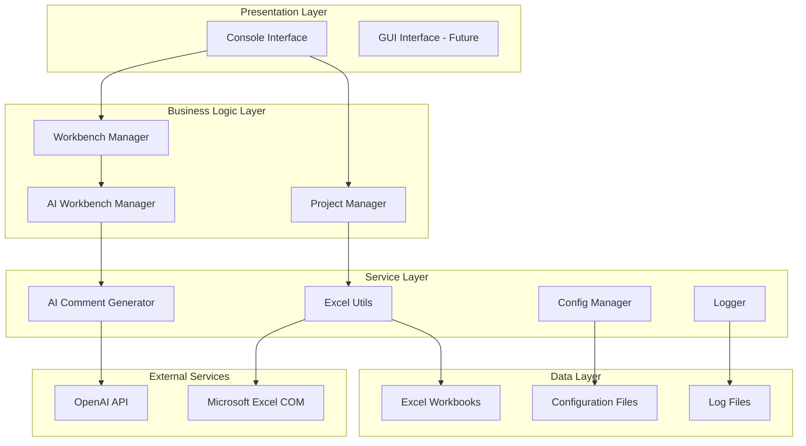
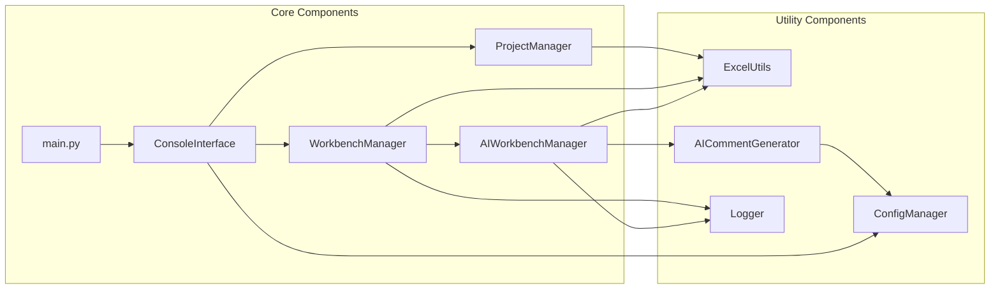
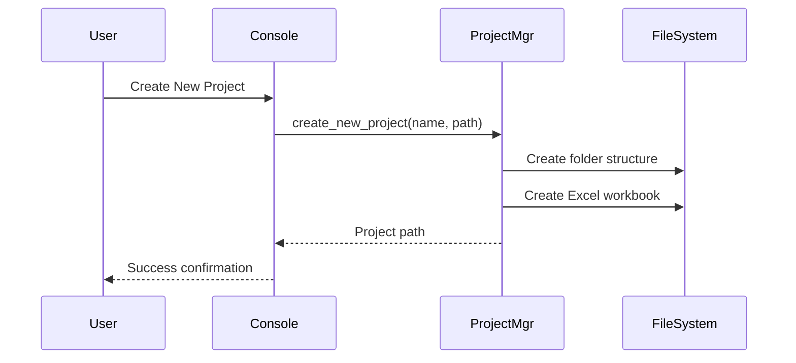
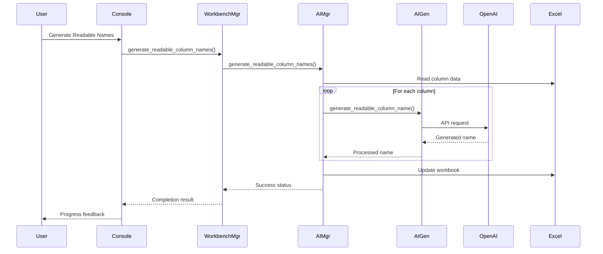

# DWH Creator - System Architecture

## 📋 Table of Contents
- [Overview](#overview)
- [Architecture Patterns](#architecture-patterns)
- [Component Structure](#component-structure)
- [Data Flow](#data-flow)
- [Technology Stack](#technology-stack)
- [Design Decisions](#design-decisions)
- [Integration Points](#integration-points)
- [Security & Performance](#security--performance)

## 🏛️ Overview

DWH Creator follows a **layered architecture** pattern with clear separation of concerns, modular design, and extensible AI integration. The system is built for maintainability, scalability, and ease of use.

### Architecture Principles

- **Separation of Concerns**: Clean boundaries between UI, business logic, and data access
- **Modularity**: Independent, reusable components
- **Extensibility**: Easy to add new features and AI capabilities
- **Testability**: Components designed for unit and integration testing
- **Configuration-Driven**: External configuration for flexibility

## 🏗️ Architecture Patterns

### 1. Layered Architecture



### 2. Component Interaction Model



## 📦 Component Structure

### Frontend Layer

#### 🔗 ANCHOR: Console Interface (`src/frontend/console_interface.py`)

**Responsibilities:**
- User interaction and menu navigation
- Input validation and user feedback
- Error handling and user notifications
- Workflow orchestration

**Key Methods:**
- 🔗 **ANCHOR**: `display_main_menu()` - Main menu presentation
- 🔗 **ANCHOR**: `handle_workbench_operations()` - Workbench workflow
- 🔗 **ANCHOR**: `_handle_readable_column_names()` - AI feature access

```python
# Key architectural pattern: Command Pattern
def handle_workbench_operations(self):
    """Workbench operations submenu with clear command routing."""
    while True:
        choice = self.get_user_choice(10)
        if choice == 7:
            self._handle_readable_column_names()  # Delegate to specific handler
```

### Business Logic Layer

#### 🔗 ANCHOR: Project Manager (`src/backend/project_manager.py`)

**Responsibilities:**
- Project lifecycle management
- File system operations
- Project structure standardization
- Excel workbook creation and management

**Key Features:**
- 🔗 **ANCHOR**: `create_new_project()` - Project initialization
- 🔗 **ANCHOR**: `Project Structure Management` - Standardized folders
- Excel COM integration for file operations

#### 🔗 ANCHOR: Workbench Manager (`src/backend/workbench_manager.py`)

**Responsibilities:**
- Core workbench operations
- Excel data management
- AI feature coordination
- Data validation and synchronization

**Key Components:**
- 🔗 **ANCHOR**: `AI Operations Integration` - AI feature delegation
- 🔗 **ANCHOR**: `Excel Sheet Operations` - Data manipulation
- 🔗 **ANCHOR**: `Validation and Sync` - Data consistency

```python
# Architectural pattern: Facade Pattern
class WorkbenchManager:
    def __init__(self, project_path: str, openai_api_key: str = None):
        self.ai_workbench = AIWorkbenchManager(workbook_path, openai_api_key)
    
    def generate_readable_column_names(self) -> bool:
        """Facade method delegating to AI workbench manager."""
        return self.ai_workbench.generate_readable_column_names()
```

#### 🔗 ANCHOR: AI Workbench Manager (`src/backend/ai_workbench_manager.py`)

**Responsibilities:**
- AI-powered feature implementation
- OpenAI API integration
- Data processing for AI operations
- Error handling for AI failures

**Key Methods:**
- 🔗 **ANCHOR**: `generate_readable_column_names()` - Core AI feature
- 🔗 **ANCHOR**: `generate_artifact_comments()` - Artifact documentation
- 🔗 **ANCHOR**: `get_ai_statistics()` - Performance monitoring

### Service Layer

#### 🔗 ANCHOR: Excel Utils (`src/utils/excel_utils.py`)

**Responsibilities:**
- Excel file operations
- COM integration management
- Data read/write operations
- File locking and concurrency

**Architecture Pattern**: **Adapter Pattern** for Excel COM interface

#### 🔗 ANCHOR: AI Comment Generator (`src/utils/ai_comment_generator.py`)

**Responsibilities:**
- Direct OpenAI API communication
- Prompt engineering and optimization
- Response processing and validation
- Error handling and retry logic

**Key Features:**
- 🔗 **ANCHOR**: `AI Prompt Engineering` - Optimized prompts
- 🔗 **ANCHOR**: `Response Processing` - Clean output formatting

### Configuration Layer

#### 🔗 ANCHOR: Config Manager (`src/utils/config_manager.py`)

**Responsibilities:**
- Application configuration management
- Excel sheet structure definitions
- Default value management
- Environment-specific settings

**Key Configurations:**
- 🔗 **ANCHOR**: `get_columns_sheet_config()` - Column definitions
- OpenAI API settings
- File path configurations

## 🔄 Data Flow

### 1. Project Creation Flow



### 2. AI Feature Execution Flow



## 🛠️ Technology Stack

### Core Technologies

| Component | Technology | Version | Purpose |
|-----------|------------|---------|---------|
| **Runtime** | Python | 3.8+ | Core application platform |
| **Excel Integration** | openpyxl | Latest | Excel file manipulation |
| **Excel COM** | win32com | Latest | Excel application control |
| **AI Integration** | openai | Latest | AI-powered features |
| **Data Processing** | pandas | Latest | Data manipulation |
| **Configuration** | configparser | Built-in | Settings management |
| **Logging** | logging | Built-in | Application monitoring |

### External Dependencies

```python
# requirements.txt
pandas>=1.3.0
openpyxl>=3.0.0
openai>=1.0.0
pywin32>=300  # For Excel COM integration
```

### Integration Points

1. **OpenAI API**: GPT model integration for AI features
2. **Microsoft Excel**: COM automation for file operations
3. **File System**: Project and configuration management
4. **Configuration Files**: INI-based settings

## 🎯 Design Decisions

### 1. **Why Layered Architecture?**

**Decision**: Implement strict layered architecture with clear boundaries

**Rationale:**
- **Maintainability**: Easy to modify individual layers
- **Testability**: Isolated components for unit testing
- **Scalability**: Can replace/enhance layers independently
- **Team Development**: Clear ownership boundaries

### 2. **Why Separate AI Manager?**

**Decision**: Create dedicated `AIWorkbenchManager` class

**Rationale:**
- **Single Responsibility**: AI features in one place
- **API Management**: Centralized OpenAI integration
- **Error Handling**: Specialized AI error management
- **Future Expansion**: Easy to add new AI features

### 3. **Why Excel Integration?**

**Decision**: Use Excel as primary data interface

**Rationale:**
- **Business User Familiarity**: Excel is universally known
- **Visual Data Management**: Easy to review and edit data
- **Template System**: Standardized workbook structures
- **Integration Ready**: Works with existing BI tools

### 4. **Why Console Interface First?**

**Decision**: Implement console interface before GUI

**Rationale:**
- **Rapid Development**: Faster to implement and test
- **Cross-Platform**: Works on any Python environment
- **Automation Friendly**: Easy to script and automate
- **Resource Efficient**: Minimal dependencies

## 🔐 Security & Performance

### Security Considerations

1. **API Key Management**
   - Configuration file storage (not in code)
   - Environment variable support
   - Key validation before use

2. **File Access Control**
   - Excel file locking detection
   - Permission validation
   - Safe file operations

3. **Data Privacy**
   - No sensitive data in logs
   - Local processing when possible
   - Configurable AI data sharing

### Performance Optimizations

1. **Lazy Loading**
   - AI manager initialization on demand
   - Excel file loading when needed
   - Configuration caching

2. **Batch Processing**
   - Multiple column processing in single session
   - Efficient Excel operations
   - Minimal API calls

3. **Error Recovery**
   - Graceful AI failure handling
   - Excel COM error recovery
   - Partial operation completion

### Monitoring & Logging

```python
# 🔗 ANCHOR: Logging Configuration
# Centralized logging with different levels
logger.info(f"Generated readable name for {column_name}: {readable_name}")
logger.warning(f"No readable name generated for {column_name}")
logger.error(f"Error generating readable name: {str(e)}")
```

## 🔄 Integration Points

### 1. OpenAI API Integration

**Location**: `src/utils/ai_comment_generator.py`
- 🔗 **ANCHOR**: `AI Client Initialization`
- 🔗 **ANCHOR**: `API Error Handling`

**Features:**
- Configurable model selection
- Rate limiting and retry logic
- Response validation and cleaning

### 2. Excel COM Integration

**Location**: `src/utils/excel_utils.py`
- 🔗 **ANCHOR**: `Excel COM Operations`
- 🔗 **ANCHOR**: `File Locking Management`

**Features:**
- Automatic file opening/closing
- Concurrent access detection
- Error recovery mechanisms

### 3. Configuration System

**Location**: `src/utils/config_manager.py`
- 🔗 **ANCHOR**: `Configuration Loading`
- 🔗 **ANCHOR**: `Default Value Management`

**Features:**
- Environment-specific configurations
- Validation and type checking
- Dynamic configuration updates

---

## 📈 Future Architecture Considerations

### Planned Enhancements

1. **GUI Layer**: Web-based or desktop GUI interface
2. **Database Integration**: Support for direct database connections
3. **API Layer**: REST API for external integrations
4. **Plugin System**: Extensible architecture for custom features
5. **Cloud Integration**: Azure/AWS deployment capabilities

### Scalability Factors

- **Multi-user Support**: Concurrent project access
- **Large Dataset Handling**: Streaming and pagination
- **Distributed Processing**: Multi-threaded AI operations
- **Cloud AI Services**: Multiple AI provider support

---

*Last updated: September 13, 2025*
