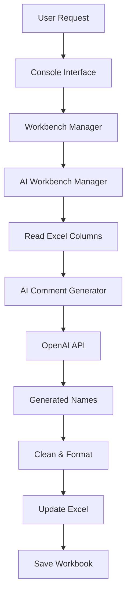

# Readable Column Names - User Guide

## 📋 Table of Contents
- [Overview](#overview)
- [Business Requirements](#business-requirements)
- [Getting Started](#getting-started)
- [Step-by-Step Usage](#step-by-step-usage)
- [Examples](#examples)
- [Best Practices](#best-practices)
- [Troubleshooting](#troubleshooting)
- [Technical Details](#technical-details)

## 🎯 Overview

The **Readable Column Names** feature automatically generates business-friendly column names from technical database column names using AI. This feature is essential for creating gold layer artifacts that are consumable by business users, Power BI reports, and downstream applications.

### Why Readable Column Names?

- **Business Accessibility**: Convert cryptic technical names to clear business terms
- **Standardization**: Ensure consistent naming across the data warehouse
- **Power BI Ready**: Generate names optimized for self-service analytics
- **Documentation**: Create self-documenting data models

## 📋 Business Requirements

Based on the **Data Warehouse Initial Prompt** specifications:

### Column Business Name Requirements:
- ✅ **Business-facing names** for end-user consumption
- ✅ **Readable format** (not cryptic technical abbreviations)
- ✅ **Gold layer ready** for views, marts, and Power BI
- ✅ **Cascade-friendly** for field propagation between stages
- ✅ **Snake_case convention** (lowercase with underscores)

### Target Use Cases:
- Gold layer view definitions
- Power BI semantic models
- Business intelligence reports
- Data mart creation
- Cross-stage field cascading

## 🚀 Getting Started

### Prerequisites

1. **Project Setup**: Have a DWH Creator project open
2. **Column Data**: Columns must exist in the workbench (imported or manually created)
3. **AI Configuration**: OpenAI API key configured in `config/config.ini`
4. **Excel Access**: Ensure Excel workbook is not open in another application

### Access the Feature

1. Start DWH Creator: `python main.py --console`
2. Open existing project or create new one
3. Navigate to **Workbench Operations** (option 3)
4. Select **Generate Readable Column Names** (option 7)

## 📝 Step-by-Step Usage

### Step 1: Open Your Project

```bash
📋 Main Menu:
1. Create New Project
2. Open Existing Project ← Select this for existing project
3. Workbench Operations
```

### Step 2: Navigate to Workbench Operations

```bash
📊 Current Project: YourProject
📋 Main Menu:
3. Workbench Operations ← Select this
```

### Step 3: Generate Readable Column Names

```bash
🔧 Workbench Operations
7. Generate Readable Column Names ← Select this
```

### Step 4: Confirm Generation

```bash
🏷️  Generate Readable Column Names
🔄 Generate readable names for all columns? (y/n): y ← Confirm
```

### Step 5: Review Results

The system will:
- Scan all columns in the workbook
- Generate AI-powered readable names
- Update the Excel workbook automatically
- Display progress and results

```bash
⏳ Generating readable column names...
✅ Generated readable name for cust_ID: customer_id
✅ Generated readable name for order_dt: order_date
✅ Successfully generated 8/8 readable column names
```

## 💡 Examples

### Common Technical → Business Name Conversions

| Technical Column | Data Type | Generated Readable Name | Business Context |
|-----------------|-----------|------------------------|------------------|
| `cust_ID` | INTEGER | `customer_id` | Customer identifier |
| `cust_Name` | VARCHAR | `customer_name` | Customer full name |
| `order_dt` | DATE | `order_date` | Order transaction date |
| `total_amt` | DECIMAL | `total_amount` | Total monetary amount |
| `prod_cat_cd` | VARCHAR | `product_category_code` | Product classification |
| `created_ts` | TIMESTAMP | `created_timestamp` | Record creation time |
| `qty` | INTEGER | `quantity` | Item quantity count |
| `eff_dt` | DATE | `effective_date` | Business effective date |

### Real-World Scenario

**Before AI Generation:**
```sql
-- Technical source columns
SELECT 
    cust_ID,
    ord_nb,
    prod_sku,
    ord_dt,
    shp_dt,
    tot_amt_USD
FROM source_orders;
```

**After AI Generation:**
```sql
-- Business-ready gold layer
SELECT 
    customer_id,
    order_number,
    product_sku,
    order_date,
    ship_date,
    total_amount_usd
FROM gold.orders_view;
```

## 🎯 Best Practices

### Before Generation

1. **Review Column Data**: Ensure all source columns are properly imported
2. **Check Data Types**: Verify data types are correctly assigned
3. **Close Excel**: Make sure Excel workbook is not open elsewhere

### During Generation

1. **Monitor Progress**: Watch the console output for any errors
2. **Network Connection**: Ensure stable internet for AI API calls
3. **Be Patient**: Large datasets may take several minutes

### After Generation

1. **Review Results**: Check generated names make business sense
2. **Manual Adjustments**: Edit any names that need refinement
3. **Save Workbook**: Use option 10 to save changes
4. **Document Changes**: Update project documentation

### Naming Guidelines

✅ **Good Examples:**
- `customer_id` (clear, concise)
- `order_date` (business-friendly)
- `total_amount` (descriptive)

❌ **Avoid:**
- `cust_identifier` (verbose)
- `orderDt` (camelCase)
- `TOT_AMT` (all caps)

## 🔍 Troubleshooting

### Common Issues

#### Issue: "AI comment generation not available"
**Solution:**
1. Check OpenAI API key in `config/config.ini`
2. Verify internet connection
3. Ensure API key has sufficient credits

#### Issue: "Excel file appears to be open"
**Solution:**
1. Close Excel application completely
2. Check for hidden Excel processes in Task Manager
3. Restart the generation process

#### Issue: "No columns found to generate readable names for"
**Solution:**
1. Import data from source systems first
2. Check the Columns sheet has data
3. Verify column names are not empty

#### Issue: Generated names are not business-friendly
**Solution:**
1. Check source column names for context
2. Manually edit generated names if needed
3. Provide feedback for AI training

### Error Messages

| Error | Cause | Solution |
|-------|-------|----------|
| `OpenAI API error` | Invalid API key or network issue | Check configuration and connection |
| `Excel file not found` | Workbook missing or moved | Verify project structure |
| `Permission denied` | File locked or insufficient permissions | Close Excel and check file permissions |

## 🔧 Technical Details

### Implementation Architecture

The feature uses multiple components working together:

#### Core Components (with Anchor References)

1. **AI Workbench Manager** (`src/backend/ai_workbench_manager.py`)
   - 🔗 **ANCHOR**: `AIWorkbenchManager Class Definition`
   - 🔗 **ANCHOR**: `generate_readable_column_names Method`

2. **AI Comment Generator** (`src/utils/ai_comment_generator.py`)
   - 🔗 **ANCHOR**: `generate_readable_column_name Method`
   - 🔗 **ANCHOR**: `AI Prompt Engineering`

3. **Workbench Manager** (`src/backend/workbench_manager.py`)
   - 🔗 **ANCHOR**: `AI Operations Integration`
   - 🔗 **ANCHOR**: `generate_readable_column_names Method`

4. **Console Interface** (`src/frontend/console_interface.py`)
   - 🔗 **ANCHOR**: `_handle_readable_column_names Method`
   - 🔗 **ANCHOR**: `Workbench Operations Menu`

### Data Flow



### Configuration

The feature relies on several configuration elements:

#### OpenAI Configuration (`config/config.ini`)
```ini
[openai]
api_key = your_api_key_here
model = gpt-3.5-turbo
temperature = 0.3
max_tokens = 30
```

#### Column Sheet Structure (`src/utils/config_manager.py`)
- 🔗 **ANCHOR**: `get_columns_sheet_config Method`
- Required columns: `Column Name`, `Data Type`, `Readable Column Name`

### AI Prompt Engineering

The AI prompt is carefully crafted to ensure quality results:

#### Key Prompt Elements:
- **Context**: Data warehouse gold layer usage
- **Format**: Snake_case requirement
- **Rules**: Keep "id" as "id", not "identifier"
- **Examples**: Common transformation patterns
- **Constraints**: 50 character limit

#### Prompt Template (Reference: AI Comment Generator)
```python
# 🔗 ANCHOR: AI Prompt Engineering
prompt = f"""
Convert this technical database column name into a business-friendly snake_case name 
for data warehouse gold layer:

Technical Name: {column_name}
Data Type: {data_type}

Rules:
- Use snake_case (lowercase with underscores)
- Keep "id" as "id", never use "identifier"
- Make business-friendly but concise
- Return ONLY the column name, no prefixes
"""
```

### Response Processing

Generated names go through multiple cleaning steps:

1. **Prefix Removal**: Strip AI response prefixes
2. **Format Conversion**: Ensure snake_case format
3. **ID Standardization**: Replace "identifier" with "id"
4. **Length Validation**: Limit to 50 characters
5. **Type Safety**: Convert to string for Excel compatibility

---

## 📞 Support

For additional help with Readable Column Names:
- Check the main [Troubleshooting Guide](troubleshooting.md)
- Review [AI Configuration Guide](ai-configuration.md)
- See [Technical Documentation](../technical/ai-integration.md)

---

*Last updated: September 13, 2025*
